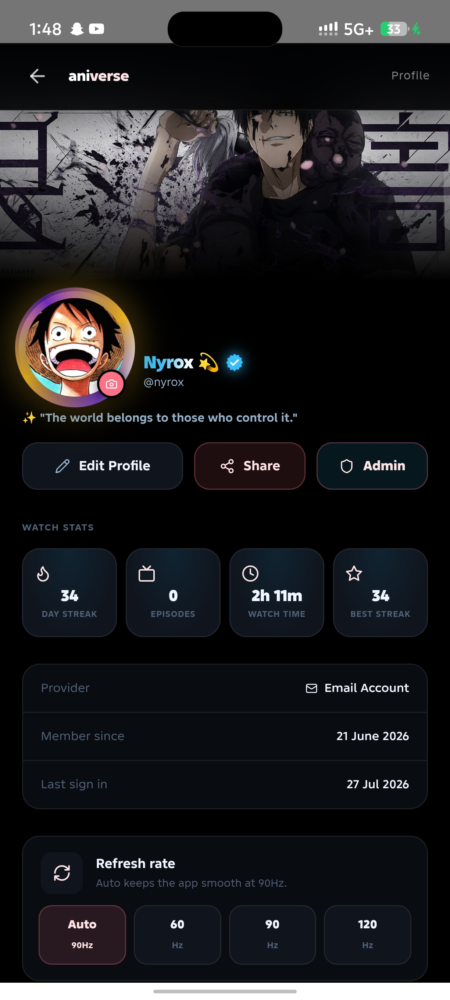
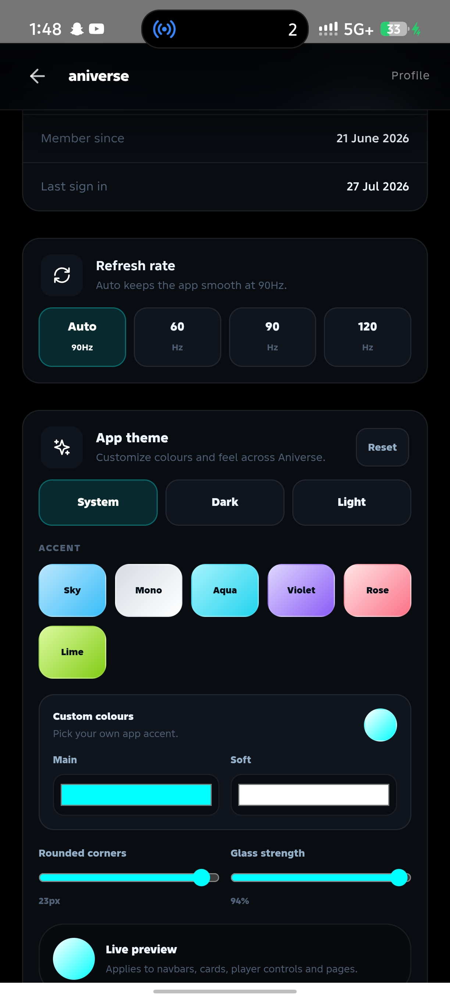

<div align="center">

<br/>

```
░█████╗░███╗░░██╗██╗██╗░░░██╗███████╗██████╗░░██████╗███████╗
██╔══██╗████╗░██║██║██║░░░██║██╔════╝██╔══██╗██╔════╝██╔════╝
███████║██╔██╗██║██║╚██╗░██╔╝█████╗░░██████╔╝╚█████╗░█████╗░░
██╔══██║██║╚████║██║░╚████╔╝░██╔══╝░░██╔══██╗░╚═══██╗██╔══╝░░
██║░░██║██║░╚███║██║░░╚██╔╝░░███████╗██║░░██║██████╔╝███████╗
╚═╝░░╚═╝╚═╝░░╚══╝╚═╝░░░╚═╝░░░╚══════╝╚═╝░░╚═╝╚═════╝░╚══════╝
```

**The ultimate multi-audio anime streaming app for Android**

<br/>

[](https://github.com/Mahfooz9835648120/aniverse-release/releases/latest)
[](#)
[](https://github.com/Mahfooz9835648120/aniverse-release/releases/tag/v1.3)
[](#disclaimer)

<br/>

> *Watch anime in Hindi, Tamil, Malayalam, English, Japanese — all in one app.*

<br/>

</div>

---

## 📸 Screenshots

<div align="center">

### 🏠 Home & Discovery

<table>
  <tr>
    <td align="center"><br/><sub><b>3D Hero Banner</b></sub></td>
    <td align="center"><br/><sub><b>Detective Conan Hero</b></sub></td>
    <td align="center"><br/><sub><b>Swipe Up to Play</b></sub></td>
    <td align="center"><br/><sub><b>Continue Watching</b></sub></td>
  </tr>
  <tr>
    <td align="center"><br/><sub><b>Manga + Anime Rows</b></sub></td>
    <td align="center"><br/><sub><b>My Watchlist</b></sub></td>
    <td align="center"><br/><sub><b>Episode List + Providers</b></sub></td>
    <td align="center"><br/><sub><b>Video Player</b></sub></td>
  </tr>
</table>

### 📖 Manga Reader

<table>
  <tr>
    <td align="center"><br/><sub><b>Manga Home</b></sub></td>
    <td align="center"><br/><sub><b>Swipe Mode + Settings</b></sub></td>
  </tr>
</table>

### 🎨 Themes & Profile

<table>
  <tr>
    <td align="center"><br/><sub><b>Profile & Watch Stats</b></sub></td>
    <td align="center"><br/><sub><b>Lime Theme</b></sub></td>
    <td align="center"><br/><sub><b>Rose Theme</b></sub></td>
  </tr>
</table>

</div>

---

## ⬇️ Installation

> ⚠️ **Updating from an older build?** This release uses a different signing key than earlier APKs, so Android will **not** let you install it as an update over an existing install. You'll need to **uninstall the old Aniverse app first**, then install this one fresh. Uninstalling clears local app data (watch history saved only on-device, custom theme settings, etc.) — anything synced to your account will still be there after signing back in.

<details open>
<summary><b>Quick Install Guide</b></summary>

<br/>

**Step 1** — Download the APK from one of the sources below

**Step 2** — On your Android device, open **Settings → Security** (or **Privacy**) and enable **Install from unknown sources** / **Install unknown apps**

**Step 3** — If you have an older Aniverse APK installed, **uninstall it first** — this release can't be installed as an update over it

**Step 4** — Open the downloaded APK file and tap **Install**

**Step 5** — Launch **Aniverse** and start watching 🎌

</details>

<br/>

### 📦 Download Sources

| Source | Link | Notes |
|--------|------|-------|
| **GitHub Releases** *(recommended)* | [⬇️ Download v1.3](https://github.com/Mahfooz9835648120/aniverse-release/releases/latest) | Always up to date |
| **StreamVerse Mirror** | [⬇️ streamverse.fun/download](https://www.streamverse.fun/download.html) | Alternative mirror |

<br/>

### 🛡️ Safety & Virus Scan

Aniverse v1.3 is **100% clean** — verified by VirusTotal, 0 detections.

[](https://www.virustotal.com/gui/file-analysis/MTYxOTY5ZDQyNjk0NDAxYWU5MzM4N2FlODE5MGE1M2M6MTc4NTE0MjM3NA==)

> 🔗 [**View full VirusTotal report →**](https://www.virustotal.com/gui/file-analysis/MTYxOTY5ZDQyNjk0NDAxYWU5MzM4N2FlODE5MGE1M2M6MTc4NTE0MjM3NA==)

Any antivirus warnings you may see are **false positives** — common for APKs that use WebView and native networking. The full scan report above confirms the file is clean.

---

## 🌟 Feature Overview

<br/>

### 🏠 Home Screen
- **3D Hero Banner** — depth-layered carousel with glass-morphism; suggests anime based on your watch history
- **Continue Watching** — pick up exactly where you left off, with per-card progress bar
- **Continue Reading** — manga chapter + page saved, resume directly from home
- **Trending Now / All-Time Popular / Picks For You** — personalised recommendation rows
- **Trending Manga** — fresh chapters updated daily

<br/>

### 🃏 Media Card Expand
**Long-press** any card anywhere in the app to expand into a detail sheet:
- Shows title, synopsis, year, type, score
- Quick-action buttons: **ⓘ Info · Share · ▶ Play · 🔖 Watchlist**
- On the hero banner — **swipe up** on an expanded card to jump straight into playback

<br/>

### 🎌 Multi-Audio Playback
Pick your language — **Hindi · Tamil · Malayalam · Telugu · Bengali · English · Japanese** — switched instantly without buffering.

<br/>

### 📺 Massive Multi-Audio Catalog

| Anime | Episodes | Multi-Audio |
|-------|----------|-------------|
| One Piece | 1150+ | ✅ Season 1–16 |
| Naruto Shippuden | 500 | ✅ Full series |
| Dragon Ball Z | 291 | ✅ Full series |
| Hunter x Hunter (2011) | 148 | ✅ Full series |
| Fairy Tail | 175+ | ✅ Available |
| + 380 more titles | — | Varies |

<br/>

### 🖥️ Player & Providers

| Provider | Description |
|----------|-------------|
| **Embed** | Default stream source |
| **Dub** | English dubbed stream |
| **English-S1/S2/S3** | Season-specific English sources |
| **Aniverse Player** | Native HLS player with subtitle support |

- **Autoplay** toggle · **Play Embed** toggle · Episode counter badge (`Ep 8 / 13`)
- **Previous / Next** episode cards with thumbnail preview
- `-10 / +10` skip · Subtitles · Settings · PiP · Fullscreen

<br/>

### 🗂️ Smart Episode Navigation
- **Arc Pills** — browse by story arc for shows ≤100 eps/season
- **Range Dropdown** — chunked 1–100, 101–200 for long series
- **TMDB / AniList Toggle** — switch episode data source for best thumbnails & titles
- 🟡 **Filler Markers** — every filler episode clearly labelled
- **List View** — thumbnail + title + NOW PLAYING indicator

<br/>

### ⏭️ Auto Features

| Feature | Description |
|---------|-------------|
| **Auto Skip Intro** | Skips opening automatically |
| **Auto Skip Outro** | Skips credits automatically |
| **Autoplay Next** | Plays next episode when current ends |

<br/>

### 📖 Manga Reader
- **Scroll mode** — classic vertical scroll
- **Swipe mode** — horizontal page-by-page like a real manga
- **Zoom** — pinch or Fit / + / − controls · **Page gap** slider
- Read position saved — resume from exact page in Continue Reading
- Supports Manga, Manhwa, Manhua

<br/>

### 🔖 Watchlist
- Add anime, movies, and manga to your personal list
- Filter by **All · Anime · Movies · Manga** · Search within list
- Long-press a card to remove

<br/>

### 🎨 Theme System

| Option | Description |
|--------|-------------|
| **System / Dark / Light** | Follows device or manual override |
| **Accent presets** | Sky · Mono · Aqua · Violet · Rose · Lime |
| **Custom colours** | Main + Soft hex; unlocks at 30-day streak |
| **Rounded corners** | Slider 0–30px |
| **Glass strength** | Blur intensity 0–100% |
| **Live preview** | See changes before applying |

<br/>

### 👤 Profile & Stats
- Avatar, banner, bio, verified badge
- **Watch Stats**: Day Streak · Episodes · Watch Time · Best Streak
- Account info: Provider · Member since · Last sign in
- **Refresh rate**: Auto / 60 / 90 / 120 Hz

---

## 🆕 What's New — v1.3

```
🐛  FIXES
──────────────────────────────────────────────────────────────────
✅  White blank player page    Fixed — player now loads correctly
                               without flashing a white screen

✅  UI/UX polish               Multiple layout and interaction
                               inconsistencies resolved


✨  NEW FEATURES
──────────────────────────────────────────────────────────────────
✅  3D Hero Banner             Redesigned home hero carousel with
                               depth and glass-morphism effect

✅  Media Card Expand          Long-press any card to expand it
                               — shows title, description, year,
                               score, and quick-action buttons
                               (Info · Share · Play · Watchlist)

✅  Swipe Up to Play           On expanded hero/card, swipe up
                               to jump straight into playback

✅  Embed + Aniverse Player    Player page now shows Available
                               Providers — choose between Embed,
                               Dub, or language-specific streams
                               (English-S1, English-S3, etc.)

✅  Manga Swipe Mode           Manga reader now supports swipe
                               (page-by-page) in addition to
                               scroll; toggle in reader settings

✅  Continue Reading           Last manga page saved — resume
                               from exactly where you left off
                               shown in home Continue Reading row

✅  Full Theme System          System / Dark / Light modes plus
                               6 accent presets: Sky · Mono ·
                               Aqua · Violet · Rose · Lime

✅  Custom Accent Colours      Pick any Main + Soft colour pair;
                               unlocks after 30-day streak

✅  Rounded Corners + Glass    Sliders for corner radius (px) and
                               glass-morphism strength (%) with
                               live preview before applying

✅  Refresh Rate Control       Manual lock at 60 / 90 / 120 Hz
                               or Auto (adapts to display)

✅  Profile & Watch Stats      Day streak · Episodes watched ·
                               Total watch time · Best streak
                               all shown on your profile page

✅  Watchlist Tabs             Filter watchlist by All · Anime
                               · Movies · Manga in one tap
```

---

## 📋 Changelog

See [CHANGELOG.md](CHANGELOG.md) for the full version history.

---

## 🐛 Report a Bug

Found something broken? [**Open an issue**](https://github.com/Mahfooz9835648120/aniverse-release/issues/new?template=bug_report.md) and include:

- Your Android version & device model
- The anime title and episode number
- Which server (1 or 2) you were on
- A screenshot or screen recording if possible

---

## ❓ FAQ

<details>
<summary><b>Why isn't my language available for a specific anime?</b></summary>
<br/>
Multi-audio availability depends on the stream provider. Most popular long-running anime (One Piece, Naruto, DBZ) have Hindi/Tamil/Malayalam dubs available. Newer or less popular titles may only have Japanese + English.
</details>

<details>
<summary><b>The stream isn't loading — what do I do?</b></summary>
<br/>
Try switching to Server 2 using the server button below the player. If both fail, the episode may not be available yet or the provider may be temporarily down.
</details>

<details>
<summary><b>Is this available on iOS?</b></summary>
<br/>
Not currently — Android only. iOS support is not planned.
</details>

<details>
<summary><b>Does the app need an account?</b></summary>
<br/>
No account required. Watch directly.
</details>

---

## ⚠️ Disclaimer

Aniverse does not host, store, or distribute any video content. All streams are sourced from independent third-party providers. This application is built for personal, non-commercial use only. The developer takes no responsibility for the content available through third-party stream sources.

---

<div align="center">

<br/>

**Aniverse v1.3**

Built by **NYROX**

<br/>

*If you enjoy the app, star ⭐ the repo and share it with fellow anime fans.*

<br/>

[](https://github.com/Mahfooz9835648120/aniverse-release/stargazers)
[](https://github.com/Mahfooz9835648120/aniverse-release/issues)
[](https://github.com/Mahfooz9835648120/aniverse-release/network/members)

<br/>

</div>
