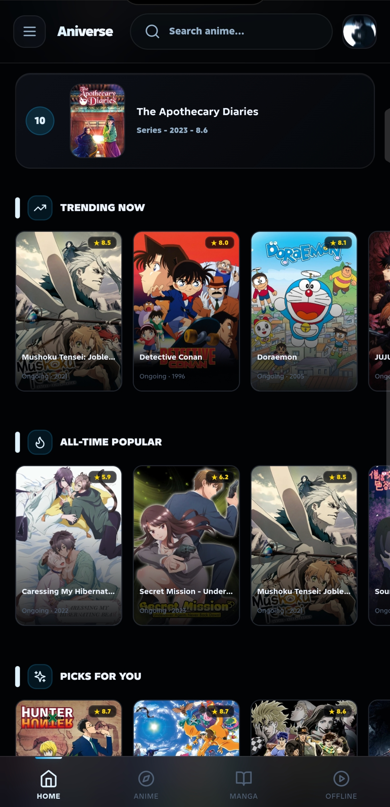
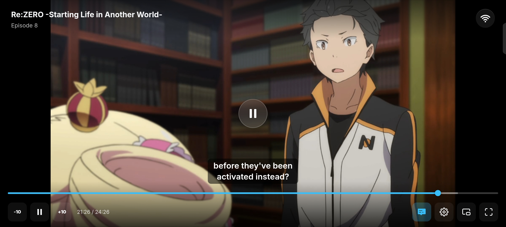
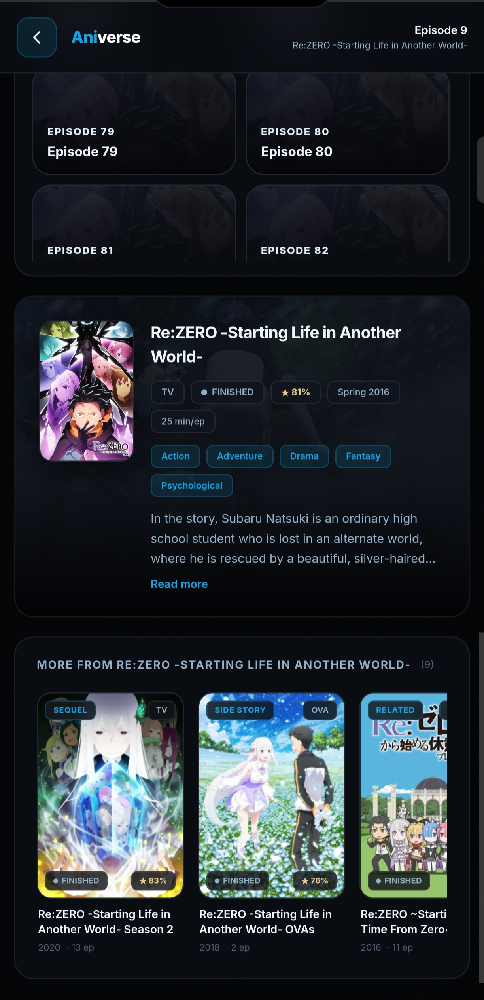
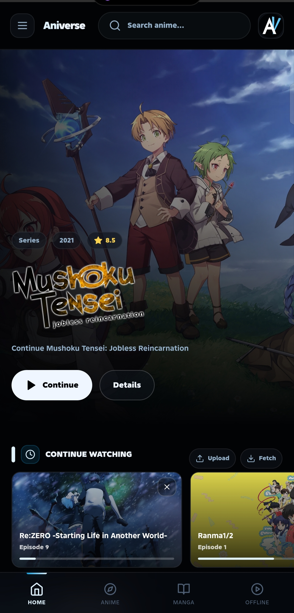

<div align="center">

<br/>

```
░█████╗░███╗░░██╗██╗██╗░░░██╗███████╗██████╗░░██████╗███████╗
██╔══██╗████╗░██║██║██║░░░██║██╔════╝██╔══██╗██╔════╝██╔════╝
███████║██╔██╗██║██║╚██╗░██╔╝█████╗░░██████╔╝╚█████╗░█████╗░░
██╔══██║██║╚████║██║░╚████╔╝░██╔══╝░░██╔══██╗░╚═══██╗██╔══╝░░
██║░░██║██║░╚███║██║░░╚██╔╝░░███████╗██║░░██║██████╔╝███████╗
╚═╝░░╚═╝╚═╝░░╚══╝╚═╝░░░╚═╝░░░╚══════╝╚═╝░░╚═╝╚═════╝░╚══════╝
```

**The ultimate multi-audio anime streaming app for Android**

<br/>

[](https://github.com/Mahfooz9835648120/aniverse-release/releases/latest)
[](#)
[](https://github.com/Mahfooz9835648120/aniverse-release/releases/tag/v1.1)
[](#disclaimer)

<br/>

> *Watch anime in Hindi, Tamil, Malayalam, English, Japanese — all in one app.*

<br/>

</div>

---

## 📸 Screenshots

<div align="center">

<table>
  <tr>
    <td align="center"><br/><sub><b>Home</b></sub></td>
    <td align="center"><br/><sub><b>Continue Watching</b></sub></td>
    <td align="center"><br/><sub><b>PLAYER PAGE</b></sub></td>
  </tr>
  <tr>
    <td align="center"><br/><sub><b>PLAYER PAGE DOWN</b></sub></td>
    <td align="center"><br/><sub><b>Homepage</b></sub></td>
    <td align="center"><br/><sub><b>Manga</b></sub></td>
  </tr>
  <tr>
    <td align="center" colspan="3"><br/><sub><b>Browswe & Search</b></sub></td>
  </tr>
</table>

</div>

---

## ⬇️ Installation

<details open>
<summary><b>Quick Install Guide</b></summary>

<br/>

**Step 1** — Download the APK from one of the sources below

**Step 2** — On your Android device, open **Settings → Security** (or **Privacy**) and enable **Install from unknown sources** / **Install unknown apps**

**Step 3** — Open the downloaded APK file and tap **Install**

**Step 4** — Launch **Aniverse** and start watching 🎌

</details>

<br/>

### 📦 Download Sources

| Source | Link | Notes |
|--------|------|-------|
| **GitHub Releases** *(recommended)* | [⬇️ Download v1.1](https://github.com/Mahfooz9835648120/aniverse-release/releases/latest) | Always up to date |
| **StreamVerse Mirror** | [⬇️ streamverse.fun/download](https://www.streamverse.fun/download.html) | Alternative mirror |

<br/>

### 🛡️ Safety & Virus Scan

Aniverse is **100% clean** — verified by VirusTotal across 70+ antivirus engines.

[](https://www.virustotal.com/gui/file/9f8d375a5606a8ca532f3891b090ee3b98eb64da9e1c8b99b8d5afdcad21dec7/community)

> 🔗 [**View full VirusTotal report →**](https://www.virustotal.com/gui/file/9f8d375a5606a8ca532f3891b090ee3b98eb64da9e1c8b99b8d5afdcad21dec7/community)
>
> SHA-256: `9f8d375a5606a8ca532f3891b090ee3b98eb64da9e1c8b99b8d5afdcad21dec7`

Any antivirus warnings you may see are **false positives** — common for APKs that use WebView and native networking. The full scan report above confirms the file is clean.

---

## 🌟 Feature Overview

<br/>

### 🎌 Multi-Audio Playback
Pick your language — **Hindi · Tamil · Malayalam · Telugu · Bengali · English · Japanese** — switched instantly without buffering or reloading. Every dubbed episode is fully synced.

<br/>

### 📺 Massive Multi-Audio Catalog

| Anime | Episodes | Multi-Audio |
|-------|----------|-------------|
| One Piece | 1150+ | ✅ Season 1–16 |
| Naruto Shippuden | 500 | ✅ Full series |
| Dragon Ball Z | 291 | ✅ Full series |
| Hunter x Hunter (2011) | 148 | ✅ Full series |
| Fairy Tail | 175+ | ✅ Available |
| + 380 more titles | — | Varies |

<br/>

### 🗂️ Smart Episode Navigation

Built for long-running anime with thousands of episodes:

- **Arc Pills** — For shows ≤100 eps per season, browse by story arc (e.g. *Kazekage Rescue*, *Long-Awaited Reunion*, *Grimmjaw*) just like Crunchyroll
- **Range Dropdown** — For 100+ episode seasons (One Piece S1 has 61 eps, Naruto has 500) — chunked into clean 1–100, 101–200 ranges
- **TMDB / AniList Toggle** — Switch episode source to get the best thumbnails, titles, and descriptions for each show
- 🟡 **Filler Markers** — Every filler episode is clearly labelled so you can skip or watch

<br/>

### ⏭️ Auto Features

| Feature | Description |
|---------|-------------|
| **Auto Skip Intro** | Skips opening automatically |
| **Auto Skip Outro** | Skips ending / credits automatically |
| **Auto Next Episode** | Plays next episode when current ends |

<br/>

### 🖥️ Player

- **Server 1 & Server 2** — One-tap switch between stream sources
- **Multi-Audio Selector** — In-player language switching
- **Desktop arrows** — Prev / Next episode arrows flanking the player on tablet & desktop
- **Smooth controls** — Fade in/out animations, keyboard-friendly

<br/>

### 🔍 Metadata & Discovery

- **AniList + TMDB** — Episode stills, titles, synopsis, air dates
- **Airing Countdown** — Live timer for next episode of ongoing shows  
- **Filler detection** — Integrated filler list for all major long-runners
- **Share & Report** — Share any episode or flag broken streams

---

## 🆕 What's New — v1.1

```
✅  Episode image fallback     No more blank dark cards — uses cover/banner when
                               TMDB still_path is missing

✅  TMDB / AniList toggle      Switch episode data source mid-session; shows when
                               AniList streamingEpisodes data is available

✅  Arc navigation             Arc pills (≤100 eps) and dropdown (>100 eps) for
                               AniList mode — browse One Piece by arc not numbers

✅  Desktop episode arrows     Prev/Next buttons beside the player on ≥768px screens

✅  Animation fix              Player controls fade correctly after seekbar interaction

✅  AniList loading fix        Resolver no longer gets stuck in loading state

✅  Format filter              anilistResolver now correctly filters TV vs MOVIE
                               results — no more wrong matches
```

---

## 📋 Changelog

See [CHANGELOG.md](CHANGELOG.md) for the full version history.

---

## 🐛 Report a Bug

Found something broken? [**Open an issue**](https://github.com/Mahfooz9835648120/aniverse-release/issues/new?template=bug_report.md) and include:

- Your Android version & device model
- The anime title and episode number
- Which server (1 or 2) you were on
- A screenshot or screen recording if possible

---

## ❓ FAQ

<details>
<summary><b>Why isn't my language available for a specific anime?</b></summary>
<br/>
Multi-audio availability depends on the stream provider. Most popular long-running anime (One Piece, Naruto, DBZ) have Hindi/Tamil/Malayalam dubs available. Newer or less popular titles may only have Japanese + English.
</details>

<details>
<summary><b>The stream isn't loading — what do I do?</b></summary>
<br/>
Try switching to Server 2 using the server button below the player. If both fail, the episode may not be available yet or the provider may be temporarily down.
</details>

<details>
<summary><b>Is this available on iOS?</b></summary>
<br/>
Not currently — Android only. iOS support is not planned.
</details>

<details>
<summary><b>Does the app need an account?</b></summary>
<br/>
No account required. Watch directly.
</details>

---

## ⚠️ Disclaimer

Aniverse does not host, store, or distribute any video content. All streams are sourced from independent third-party providers. This application is built for personal, non-commercial use only. The developer takes no responsibility for the content available through third-party stream sources.

---

<div align="center">

<br/>

**Aniverse v1.1**

Built by **NYROX**

<br/>

*If you enjoy the app, star ⭐ the repo and share it with fellow anime fans.*

<br/>

[](https://github.com/Mahfooz9835648120/aniverse-release/stargazers)
[](https://github.com/Mahfooz9835648120/aniverse-release/issues)
[](https://github.com/Mahfooz9835648120/aniverse-release/network/members)

<br/>

</div>
